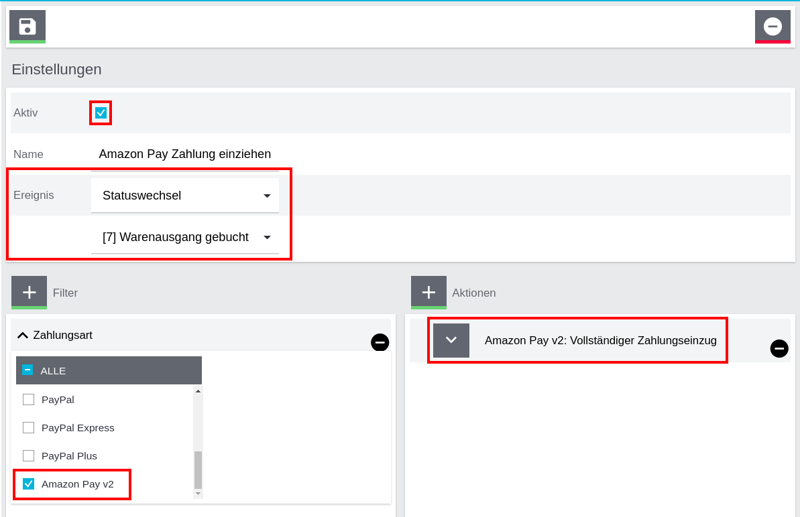
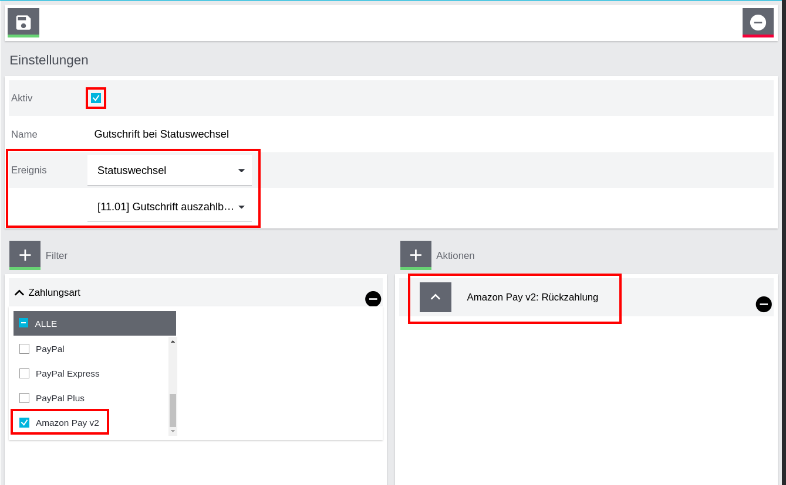

!!! warning "Translation"
    This document has been translated automatically. It may contain minor translation errors and the videos' audio track is still in German.
##About this plugin
_Amazon Pay Checkout v2_ is the new conversion optimised checkout solution from Amazon Pay with seamless integration into the plentyShop LTS.
the plentyShop LTS.  
Enable over 300 million Amazon customers to log in and pay on your website. Every
Amazon customer can use this payment method immediately in your shop.

## Requirements

### System requirements

* [x] plentyShop LTS Version 5+
* [x] IO Plugin Version 5+

## Amazon merchant account
!!! info
    If you already have an active Amazon Pay account that you have used with other plugins, for example, you can skip this step.

### Set up Amazon merchant account

In order to use Amazon Pay, you need an Amazon Pay merchant account, even if you already have another Amazon
merchant account. To begin the registration process, go to the Amazon
Pay website (https://pay.amazon.de) and click the 'Register' button in the upper right corner of the
web page.

!!! danger "Important"
    When setting up an Amazon Pay merchant account, you cannot use an existing account that you already use for
    for selling on Amazon.

The email address associated with your new Amazon Pay merchant account must be different from the email address,
you use for any other Amazon account.   
Also, please ensure that you have signed out of all Amazon accounts before you begin the Amazon
Pay registration process.

### Required information

You will need to provide your business information to register for an Amazon Payments merchant account. Please
be sure to enter the information so that it exactly matches the information in your official verification documents.
official verification documents.
The information on these registration pages is verified by Amazon, and incorrect or discrepant information may result in delays.
may result in delays.
For more information, please visit https://pay.amazon.de/help/202153180

##Installation

!!! tip "Test Plugin Set"
    As with any intervention in your system, you should run everything in a test plug-in set in advance and only use it live after you have checked its
    functionality.

### Plenty Marketplace

You will find the current version in the [plentyMarketplace](https://marketplace.plentymarkets.com/amazonpaycheckout_55304) and can install and update it from there as usual.
install and update it as usual.

### GitHub
The Amazon Pay button is greyed out. What can I do?
Alternatively, and for faster updates, you are also welcome to
directly [our GitHub repository](https://github.com/AlkimMedia/AmazonPay_Plenty_CV2) for integration. In the "main"
branch all updates are published continuously. There are separate branches for certain versions.

### Including logos

If you display logos of the supported payment methods in your theme, you will find a selection of Amazon Pay logos here in
different colours and formats:  
[:fontawesome-solid-download: Download Logos](images/amazon_pay_logo_pack.zip){:.md-button.md-button--primary.block.centre.mt5}

## Configuration

### Plugin setup

!!! info
    All setting options can be found as usual in the _Plugin-Set-Overview_.

### Take over Sellercentral data

In order for the plugin to be able to communicate with Amazon Pay, the Amazon Pay access data must be stored in the first step of the configuration.
access data must be stored in the first step of the configuration. You will find these in
your [Sellercentral](https://sellercentral-europe.amazon.com/gp/pyop/seller/integrationcentral/). You can see how to
you can see in this video:

<video controls width="100%">
<source src="video/sellercentral.mp4" type="video/mp4">
Sorry, your browser doesn't support embedded videos.
</video>

### Set up IPN
__🎞️ All the info on the IPN in this video__
<video controls width="100%">
<source src="video/ipn.mp4" type="video/mp4">
Sorry, your browser doesn't support embedded videos.
</video>

!!! danger "Sandbox / Production"
    The configuration of the IPN must be done separately for the sandbox and the production environment.

The IPN (_Instant Payment Notification_) ensures that your plentymarkets system is informed in real time about the current status of payments.
of payments in real time.
To do this, store the IPN in your Sellercentral under [_Settings_ "
_Integration Settings_](https://sellercentral-europe.amazon.com/gp/pyop/seller/account/settings/user-settings-view.html) `https://www.domain.com/payment/amazon-pay-ipn/` (`www.domain.com`)
please replace with your shop domain) as _merchant URL_.

### Container links
The following container links should be set. Please note that the standard links are only partially sufficient because they only allow a 1:1 allocation.

!!! success "Amazon Pay Checkout - Button"
    This content creates the button that redirects the customer to Amazon Checkout. In principle, you can place it anywhere that makes sense to you. The following list provides suggestions, but it is of course up to you whether you want to display it before or after the normal checkout button in "Shopping cart" and "Shopping cart preview".

    ✓ Shopping cart: After "Checkout" button  
    ✓ Shopping cart overlay: Extend buttons  
    ✓ Shopping cart preview: After "Checkout" button  

!!! success "Amazon Pay Checkout - Button on item page (quick purchase)"
    ✓ Single item: After "Add to shopping cart" button

!!! success "Amazon Pay Login - Button"
    ✓ Login overlay: Container in a row with the buttons
    ✓ Registration overlay: Container in a row with the buttons

### ShopBuilder
To integrate the Amazon buttons on pages designed with the ShopBuilder, the code element can be used.
!!! note "Login-Button"
    Use this code for a login button that creates a customer account but does not necessarily lead the customer to the checkout:

    `

`

!!! note "Checkout button"
    Use this code for a checkout button that initiates the Amazon Pay checkout:

    `

`

### Other plugin settings
__🎞️ All info about the settings in this video__
<video controls width="100%">
<source src="video/settings.mp4" type="video/mp4">
Sorry, your browser doesn't support embedded videos.
</video>

<dl>
<dt>Enable sandbox</dt>
<dd>Switches the plugin into sandbox mode. This will not trigger any real payments. Please note that there are separate configuration options for sandbox mode in Sellercentral.</dd>
<dt>Hide buttons (debug)</dt>
<dd>Hide the buttons in the frontend with CSS (display:none) so you can test in the frontend without affecting your customers. (see <a href="#test">test</a>)</dd>
<dt>Type of authorisation</dt>
<dd>This allows you to set when the payment should be authorised. If you have no special requirements, you should leave it at the default setting here.
If you select the default setting 'Unconditionally during checkout', the plug-in will attempt to authorise the payment during checkout, 
in order to persuade the customer to select a different payment method in the event of rejection. 
</dd>
<dt>Type of payment collection</dt>
<dd>In the vast majority of cases, direct debit after authorisation is the best choice.</dd>
<dt>Order status after successful authorisation</dt>
<dd>Here you can store a status ID (e.g. 5.0). This is set after successful authorisation to indicate that the goods can be dispatched. In order to use the automatic inventory system, "4/5" can also be entered here so that the status is set to 4.0 or 5.0, depending on the inventory.</dd>
<dt>Use email address for shipping address</dt>
<dd>If this setting is activated, the customer's e-mail address is included in the shipping address (e.g. for handing over to parcel services)</dd>
</dl>

##Payment process
An Amazon Pay payment consists of two parts: An authorisation and the actual payment collection. This gives you
the option of not collecting the payment until it is shipped, as Amazon Pay guarantees the successful
collection for a certain period of time. Nevertheless, it is advantageous to collect the payment immediately, as it may otherwise be necessary for the
Otherwise, for security reasons, it may be necessary for the customer to reconfirm the payment, which can lead to delays.

You have a variety of options in the plugin settings to set the payment process that suits you best.

!!! info "Quick start"
    If you have no special requirements for your payment process, you can keep the original settings.
    retained. In this case, the payment is always collected immediately and you only have to make refunds either per
    event procedure or directly in Sellercentral.

### Event Procedures

!!! danger "Important"
    With event procedures, the plugin configuration of the main client is loaded. Please configure the plugin
    with all access data in the plug-in set of the main client.
    event procedures can be set up under: `set-up` > `orders` > `events`.

#### Complete collection of Amazon Pay payment

This event procedure only needs to be set up if the payment is not to be collected directly after authorisation.
should be made. It makes sense to link it to the dispatch, e.g. to the status change to `[7] Shipped`.

This could look like this

#### Refund of Amazon Pay payment

In order to refund customers a payment in the case of a credit note, e.g. in the case of a return, you could use this event procedure
for example, for the status change of a credit note or the creation of the credit note document. The action
initiates a refund in the amount of the credit memo you created.

This could look like this

##Test

###Sandbox
To test the integration, it is advisable to switch to sandbox mode, as no real transactions are then
are carried out. To test Amazon Pay in your shop frontend from the customer's point of view, you need a special test account.
test account, as real login data from Amazon accounts do not work in the sandbox. You can create a test account
create a test account here in your Sellercentral:  
[https://sellercentral.amazon.de/gp/pyop/seller/testing](https://sellercentral.amazon.de/gp/pyop/seller/testing)

Amazon Pay provides an English video tutorial here:  
[Youtube video](https://www.youtube.com/watch?v=UFK4cnxH3F4)

###Hidden buttons
If you are testing in your live shop, you can have the Amazon Pay buttons hidden by setting the option "Buttons" in the
plugin configuration by selecting the option "Hide buttons (debug)". In order to display the hidden buttons, you can
enter this command in your browser console:

    jQuery('.amazon-pay-button, .amzLoginButton').css('cssText', 'display:block !important;');

##Help
If you still have questions or unexpected problems, please contact our support.

[:fontawesome-solid-envelope: contact support](mailto:info@alkim.de){:.md-button.md-button--primary.block.centre.mt5}